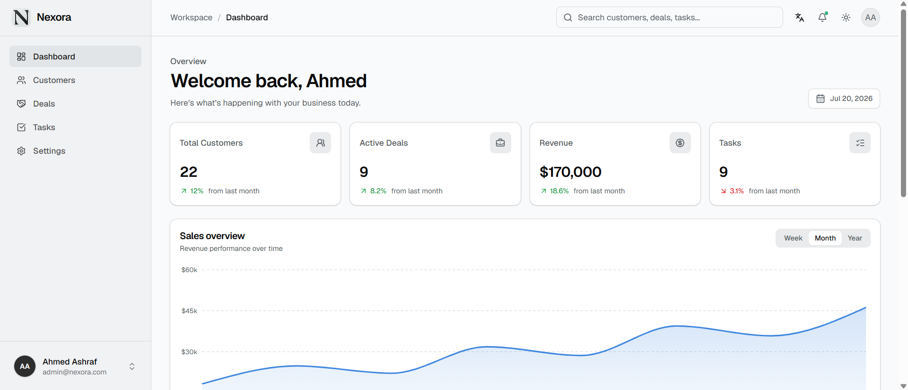
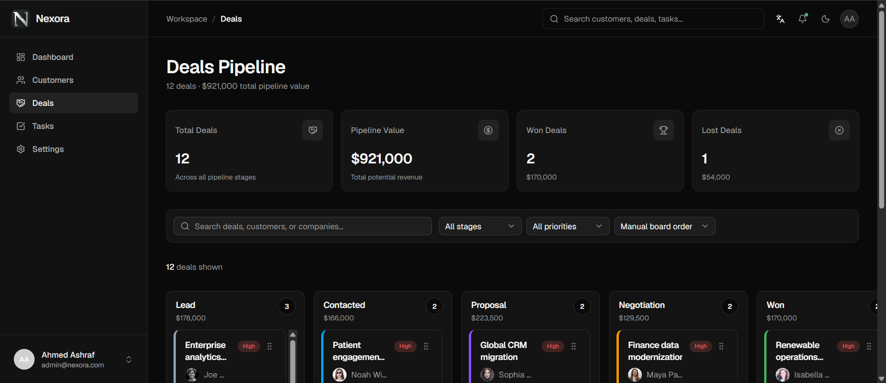
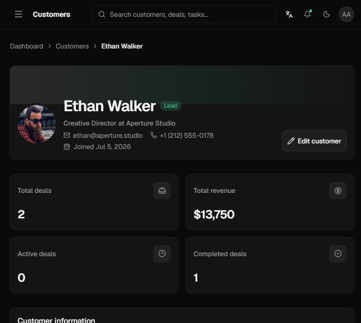
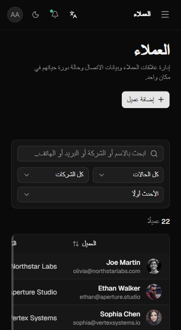
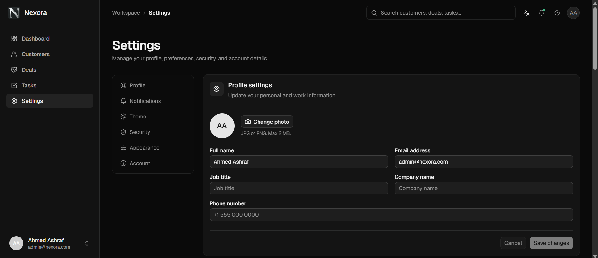

# Nexora CRM Dashboard

Nexora is a modern, responsive, bilingual CRM dashboard for managing customers, deals, tasks, sales activity, and workspace preferences. It provides a polished demonstration interface backed by typed local data, persistent browser preferences, and browser-based demo authentication.

## Product Preview

### Dashboard



### Deals Pipeline



## Features

- Protected demo authentication with validation, remembered or temporary sessions, route redirects, and logout
- Business dashboard with KPI trends, interactive sales charts, recent customer activity, and upcoming tasks
- Searchable, sortable, filterable, and paginated customer directory with demo row actions
- Detailed customer profiles with contact information, revenue statistics, activity history, notes, and related deals
- Six-stage Kanban sales pipeline with search, filters, sorting, deal previews, and pointer, touch, or keyboard drag-and-drop
- Locally persisted deal ordering and pipeline stages across browser visits
- Task workspace with live summary metrics, overdue detection, search, status and priority filters, and sorting
- Editable profile plus persisted notification, appearance, theme, and security preferences
- English and Arabic localized routes with an RTL Arabic interface and in-app language switching
- Responsive desktop navigation and an accessible mobile drawer
- Light, dark, and system themes
- Route-level loading skeletons, empty states, form validation, error recovery, and custom 404 states
- Reduced-motion support, accessible announcements, and keyboard-friendly controls
- Unit tests for directory and persistence logic, plus Playwright end-to-end coverage for authentication, routing, localization, responsive navigation, search, and theme persistence

## Tech Stack

- [Next.js 16](https://nextjs.org/) with the App Router
- [React 19](https://react.dev/)
- [TypeScript 5](https://www.typescriptlang.org/)
- [Tailwind CSS 4](https://tailwindcss.com/)
- [next-intl](https://next-intl.dev/) for localization
- [dnd kit](https://dndkit.com/) for the accessible sales pipeline
- [Base UI](https://base-ui.com/) and shadcn components
- [React Hook Form](https://react-hook-form.com/) and [Zod](https://zod.dev/)
- [Recharts](https://recharts.org/) for data visualization
- [Motion](https://motion.dev/) for animations
- [Lucide React](https://lucide.dev/) for icons
- [Vitest](https://vitest.dev/) and [Playwright](https://playwright.dev/) for testing

## Folder Structure

```text
nexora/
|-- app/                      # Localized routes, layouts, metadata, and route states
|   `-- [locale]/
|       |-- (dashboard)/      # Protected CRM routes
|       `-- login/            # Authentication screen
|-- components/
|   |-- auth/                 # Demo authentication components
|   |-- brand/                # Nexora branding
|   |-- customers/            # Customer directory and detail views
|   |-- dashboard/            # Dashboard widgets and charts
|   |-- deals/                # Sales pipeline components
|   |-- layout/               # Sidebar, navbar, and application shell
|   |-- settings/             # Profile and preference forms
|   |-- shared/               # Reusable product-level components
|   |-- tasks/                # Task management components
|   `-- ui/                   # Reusable UI primitives
|-- data/                     # Typed demonstration datasets
|-- lib/                      # Shared utilities, auth, and deal persistence
|-- src/
|   |-- i18n/                 # Localized navigation and request configuration
|   `-- messages/             # English and Arabic message catalogs
|-- tests/                    # Vitest unit tests and Playwright E2E tests
|-- public/                   # Brand assets and favicon
`-- proxy.ts                  # Localization, route protection, and redirects
```

## Installation

### Prerequisites

- Node.js 20.9 or newer
- npm

### Setup

```bash
git clone <repository-url>
cd nexora
npm ci
npm run dev
```

Open [http://localhost:3000](http://localhost:3000) in your browser. Demo credentials are displayed on the sign-in page.

## Environment Setup

No environment variables are required for the current demo. Authentication and CRM data are stored locally for interface demonstration purposes. Set `NEXT_PUBLIC_APP_URL` to the canonical production URL when it differs from the default Vercel URL used by the metadata configuration.

When connecting a production backend:

1. Store local secrets in `.env.local`.
2. Keep all environment files containing secrets out of version control.
3. Prefix only intentionally public browser variables with `NEXT_PUBLIC_`.
4. Validate authentication and authorization on the server.

Example:

```env
NEXT_PUBLIC_APP_URL=https://crm.example.com
DATABASE_URL=
AUTH_SECRET=
```

## Available Scripts

| Command | Description |
| --- | --- |
| `npm run dev` | Start the development server |
| `npm run lint` | Run ESLint across the project |
| `npm run test` | Run the Vitest unit test suite once |
| `npm run test:watch` | Run unit tests in watch mode |
| `npm run test:e2e` | Build the app, start it locally, and run Playwright tests |
| `npm run test:e2e:run` | Run Playwright against an already running test server |
| `npm run test:all` | Run lint, unit tests, E2E tests, and a final production build |
| `npm run build` | Create and validate an optimized production build |
| `npm run start` | Serve the production build locally |

## Quality Verification

Before opening a pull request or deploying, run:

```bash
npm run lint
npm run test
npm run build
```

For the complete automated check, including browser tests, run `npm run test:all`. The interface is designed for mobile through ultra-wide viewport sizes.

## Screenshots

### Customer Profile

Customer profiles bring contact details, revenue statistics, activity, notes, and related deals into one view.



### Arabic Mobile Experience

Localized English and Arabic routes include a responsive RTL interface for mobile screens.



### Settings

Profile, notification, theme, security, and appearance preferences are managed from a unified settings workspace.



## Deployment on Vercel

1. Push the repository to GitHub, GitLab, or Bitbucket.
2. Import the repository into [Vercel](https://vercel.com/new).
3. Keep the automatically detected Next.js build settings.
4. Add production environment variables when backend services are introduced.
5. Deploy and verify protected routes, metadata, localization, and authentication redirects.

If the deployment domain differs from the configured URL, update `metadataBase` in `app/[locale]/layout.tsx`.

> [!IMPORTANT]
> The included authentication is a client-side demonstration. Replace it with secure, server-validated sessions and authorization before storing real customer information or exposing privileged operations.

## Future Improvements

- Connect a production database and CRM API through a server-only data layer
- Replace demo authentication with a secure identity provider
- Run the existing unit and end-to-end suites in CI
- Add audit logging, application monitoring, and Web Vitals reporting
- Add role-based access control and team management

## License

Add the appropriate project license before public distribution.
